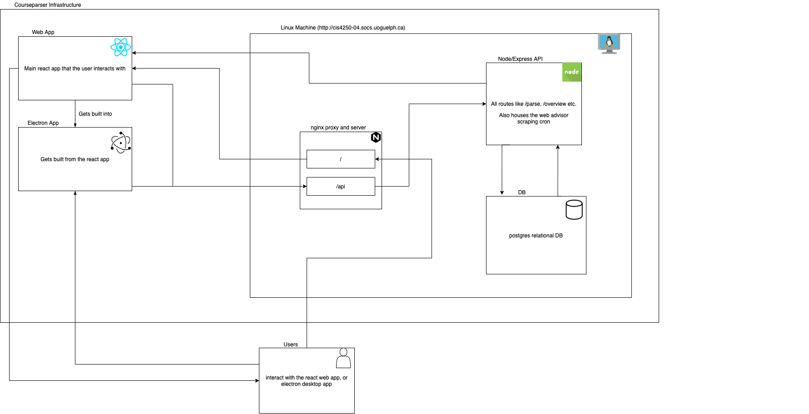

# CourseParser

This is the mono repo for course CIS\*4250 Team 4. It currently consists of 2 services or packages:

- `server`
  - our API and server infrastructure
- `electron`
  - our electron app and web views

## Running the Monorepo

- **you must have lerna installed globally** - `npm i --g lerna`
- install all dependencies - `npm run bootstrap`
- start all services - `npm run start` or `npm start`
  <br /><br />
- running just the CLI can be accomplished by `npm run cli`
  - note the output will not be as nice since we are streaming all output via lerna, but this functionality will be removed soon anyway

## Adding Dependencies

- Lerna will bundle our common dependencies as to not install them twice for each package
- To install a dependency for a specific package run `lerna add <package_name> packages/<service>`
  - Ex. `lerna add react packages/electron` will add react to our electron service only
- To install a shared dependency run `lerna add <package>`
  - this will install the dependency in all modules/services

## tmux and building the applications

- tmux is used to persist our sessions while still allowing shared SSH access
- attach to the session - `tmux attach -t courseparser`
- switch windows `ctrl + b then the arrow key up or down`
- detatch from the session `ctrl + b then d`
- the top window is where the server is running
- the bottom window is where the web app is built

### Server Running (run on linux server)

- currently the server is not built and just running in dev, but that is fine for now
- start the server - `npm run start:server`
- server is running on local address - `localhost:8080`
- this is proxied to the public URL `http://cis4250-04.socs.uoguelph.ca/api`

### Web App Building (run on linux server)

- from top level - `npm run build:web`
- static build is output to - `/packages/electron/build`
- nginx will serve the static build to - `http://cis4250-04.socs.uoguelph.ca`

### Electron App Building (run on your machine)

- cd into electron package - `cd packages/electron`
- build react app - `npm run build-web`
- build electron app - `npm run build-electron:<TYPE>`
  - where `<TYPE>` is either `mac` or `win` based on what type of executable you want to output
- electron build is output to - `/packages/electron/release-builds`

### nginx setup

- nginx is currently serving our static files for the web app as well as reverse proxying our server
- the config is located at `/etc/nginx/conf.d/courseparser.conf`
- a request to just `http://cis4250-04.socs.uoguelph.ca` will serve our web application
- any requests to `http://cis4250-04.socs.uoguelph.ca/api` will hit the server
  - an example request is `http://cis4250-04.socs.uoguelph.ca/api/parse`
- the config in its entirety currently looks like:

```
server {
  listen 80;
  listen [::]:80;

  server_name cis4250-04.socs.uoguelph.ca;

  location /api {
    proxy_pass http://localhost:8080;
  }

  location / {
    root /home/sysadmin/W21CIS4250Team4/packages/electron/build;
    index index.html;
    # proxy_pass http://localhost:5000/;
  }
}
```

### development and deploying workflow

- because we run both the web/electron app and the server locally when developing, those changes will not immediately be present on the linux server once we merge them
- once things get merged in, we need to do the following:
- ssh into the linux machine
- cd to the repository
- pull master
- attach to the tmux instance (`tmux attach -t courseparser`)
- restart the server in the top window (kill the server and restart it)
  - it may yell at you that the port is in use, so simply find it(`lsof -i tcp:8080`), grab the pid and then `kill -9 <PID>`
  - you can then run `npm run start:server` from the top level
- we also need to re-build the web app (`npm run build:web`) and thats it, nginx will automatically serve this built folder

### Architecture Overview

- the basic high level overview of the course parser infrastructure
  

## Cypress Integration Testing

- All tests written in `packages/electron/cypress/integration`

How To Run Tests In Cypress:

- From the root directory, make sure the electron app is running `npm run start`
- In another terminal, from the root directory, run `npm run test:electron` to start the cypress app
- Select a test file to see the test suite running on the app

## Upkeep
- Due to Guelph university changing their course registration, the webscraping for specific course information including available spots and professor no longer function.
- Copying and pasting transcript also no longer works due to a change in it's layout.
- As no database is connected, a short demo can be found in the root directory named "demo.mp4" which can be used to see the functionality
